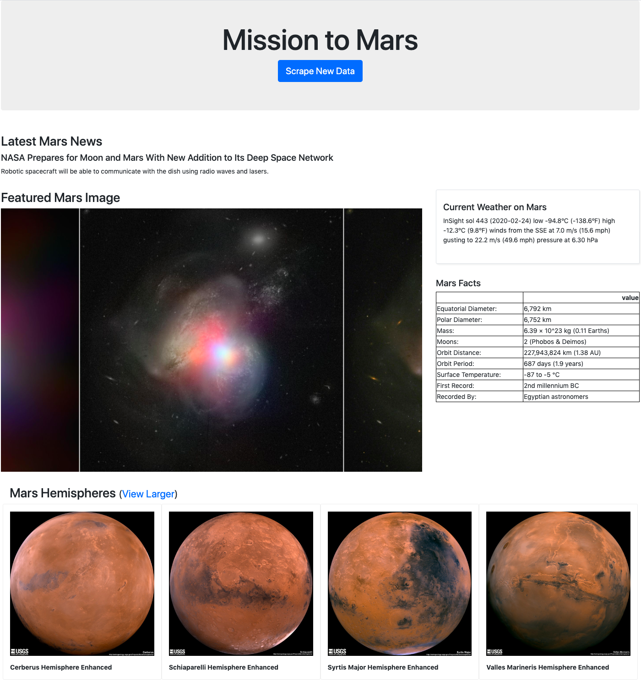

# web-scraping-challenge
For this project I used **Python, Flask, Beautiful Soup, Jinja and MongoDB** to scrape several live Mars websites for the most current information. Most of the scraped data required Python string manipulation and data type conversion ([scrape_mars.py](scrape_mars.py)). The formatted data was saved in a Mongo DB. In the Flask website ([app.py](app.py)), one could click a button to re-scrape for Mars information and re-fill the webpage again.

To preview the Flask website:
1. Clone this repo to your local drive.
2. Launch python app.py from your bash or terminal.
3. Preview from a local port in your browser (i.e., http://127.0.0.1:5000/)

### Resources:
- [NASA Mars News Site](https://mars.nasa.gov/news/)
- [Mars Weather Twitter](https://twitter.com/marswxreport?lang=en)
- [JPL Featured Space Image](https://www.jpl.nasa.gov/spaceimages/?search=&category=Mars)
- [Mars Facts](https://space-facts.com/mars/)
- [Mars Hemispheres from USGS Astrogeology](https://astrogeology.usgs.gov/search/results?q=hemisphere+enhanced&k1=target&v1=Mars)

### Screenshot:
